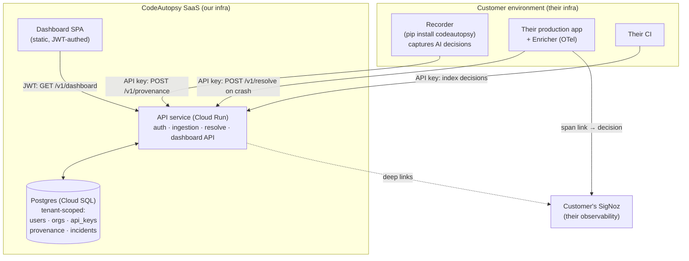
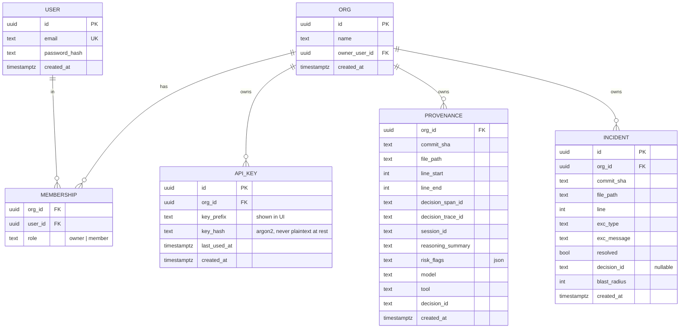

# CodeAutopsy — Architecture & Milestone Plan

> **Purpose of this document.** This is the living design for turning CodeAutopsy from a
> single-tenant hackathon spine into a **multi-tenant hosted SaaS that anyone can sign up for
> and use on their own codebase.** It is the source of truth we build against. Every milestone
> below has a concrete "done" definition so progress is unambiguous across sessions.

---

## 0. Where we are today (honest current state)

What exists and is **live** right now:

- A working **single-tenant spine**: Recorder → Provenance store/indexer/service → Sample app +
  Enricher → Coroner CLI → Fix Bot. The core mechanism (a runtime crash resolves back to the AI
  decision that wrote the crashing line, via a `git blame` join) is validated end-to-end.
- **Persistence**: provenance data in Cloud SQL (Postgres), survives redeploys.
- **Infra**: two Cloud Run services, Artifact Registry, Secret Manager, Workload Identity
  Federation, full CI/CD (test + deploy) on GitHub Actions. 100% test coverage on the core.
- **Web**: a marketing landing page and a **scripted demo of one hardcoded bug**.

**The gap.** None of this is usable by a stranger on *their own* code. There are no accounts, no
data isolation, no way to push your own decisions, no dashboard. The demo replays one seeded
crash. Closing that gap is what the rest of this document plans.

This whole section is **Milestone 0** and it is **done**.

---

## 1. Product vision — what "solves it for anyone" means

A developer should be able to:

1. **Sign up** at codeautopsy (email + password), and get an **organization** and an **API key**.
2. `pip install codeautopsy`, drop the **Recorder** into their repo / CI, and set their API key.
   From then on, every AI-assisted change is captured as a **decision** (reasoning, risk flags,
   model, tool) indexed against the commit + file + line it produced.
3. Instrument their production runtime with the **Enricher** (a few lines of OTel setup). When
   their app crashes, the crash **resolves** to the exact AI decision that authored the crashing
   line, and a span link is written into **their** SigNoz.
4. Open a **dashboard** and see their decisions, their resolved crashes over time, and (later)
   the auto-generated Fix Bot PRs — all **isolated to their organization**.

The product's job is to make "which AI decision caused this production bug, and why" a one-click
answer, for anybody, on their own code, with their data kept private to their org.

---

## 2. Target system architecture

**Principle: the customer's source code never leaves their infrastructure.** See §4.

---

## 3. Component responsibilities (target)

| Component | Package | Responsibility in the SaaS |
|---|---|---|
| **API service** | `codeautopsy/api/` (new) | The single Cloud Run service. Hosts auth, ingestion, resolve, and the dashboard API. Wraps the existing provenance logic behind tenant-scoped, authenticated endpoints. |
| **Accounts** | `codeautopsy/accounts/` (new) | Users, organizations, memberships, API keys, password hashing, JWT sessions. |
| **Provenance** | `codeautopsy/provenance/` (exists) | The store + git-blame indexer + resolve engine. Gets a `tenant_id` on every row and every query. |
| **Recorder** | `codeautopsy/recorder/` (exists) | Captures AI decisions from a Claude Code session and indexes them. Gains API-key auth + configurable remote API URL so it can push to the SaaS. |
| **Enricher** | `codeautopsy/enricher/` (exists) | Runs in the customer runtime. On a crash, does the blame **at the edge** and calls `/v1/resolve`. Mints the SigNoz span link. |
| **Coroner CLI** | `codeautopsy/cli/` (exists) | Local inspection; gains authenticated remote queries. |
| **Fix Bot** | `codeautopsy/fixbot/` (exists) | Synthesizes a fix PR. Later wired to open PRs into the customer's connected repo. |
| **Dashboard SPA** | `docs/app/` (new) | Signup, login, onboarding, dashboard, settings. Static, calls the API with a JWT. |

---

## 4. The key architectural decision: edge-side blame

The `git blame` join is the heart of the product — but blame needs the repo checked out at the
deployed commit. The naive SaaS design would **host a clone of every customer's source code** so
we can blame server-side. That is a huge liability (source code is a customer's crown jewels)
and a large infra cost.

**We avoid it.** The join has two paths, and only one ever needs the repo:

- **Fast path (no repo needed):** a decision recorded *directly* against the deployed commit +
  line. `resolve()` just does a keyed lookup: `(tenant_id, commit_sha, file, line) → decision`.
  The Recorder already tags decisions with the deploy SHA, so this path covers the common case
  and requires **zero** access to customer source.
- **Blame path (repo needed):** when the deployed line drifted from the introducing commit. Here
  we push the blame **to the customer's edge**: the Enricher (running in their infra, where the
  repo already is) runs `git blame`, resolves the *introducing commit + original line*, and sends
  **only those identifiers** to `/v1/resolve`. We look up the decision by identifier. **The source
  never touches our servers.**

Server-side blame (via a GitHub App with read access) becomes an *optional* enhancement in
Milestone 4 for customers who prefer it — never a requirement.

> **Decision D1:** Core resolve works **without hosting customer source**. Blame happens at the
> edge; we store only commit/file/line identifiers and decision metadata. *(Reversible later, but
> this shapes M1–M3.)*

---

## 5. Data model & tenant isolation

Every domain row carries a `tenant_id` (the organization id). **Every query filters by the
`tenant_id` derived from the authenticated principal — never from client input.** This is the #1
security invariant of the system.

- The existing `provenance` table gains `org_id` + a composite index `(org_id, commit_sha,
  file_path, line_start, line_end)`.
- New `incidents` table records every resolution attempt → powers the dashboard timeline.
- **Isolation strategy:** application-level scoping in M1 (every store method takes an `org_id`
  and filters on it), hardened with **Postgres Row-Level Security policies** in M7 as defense in
  depth.

> **Decision D2:** 1 user = 1 org at signup (personal org). Teams / multiple members come in a
> later milestone — but the schema (ORG + MEMBERSHIP) supports teams from day one so we don't
> migrate later.

---

## 6. Auth & access model

Two distinct principals, two distinct mechanisms:

| Principal | Used by | Mechanism | Carries |
|---|---|---|---|
| **Human (dashboard)** | The SPA in a browser | **JWT** issued on login, short-lived, in memory / storage; refresh flow | `user_id`, `org_id` |
| **Machine (ingestion)** | Recorder, CI, Enricher | **API key** (`ca_live_<prefix>_<secret>`), sent as a bearer/header | resolves to `org_id` |

- Passwords hashed with **argon2** (`argon2-cffi`), never reversible.
- API keys: generated once, shown once, **stored hashed** (argon2). The UI shows only the prefix.
- JWT signing secret lives in **Secret Manager**, injected like the DB DSN.
- Auth is a FastAPI dependency: `require_user()` (JWT → principal) and `require_api_key()`
  (key → org). Endpoints declare which they need; the resolved `org_id` is the *only* source of
  tenant scope.

> **Decision D3:** Email/password auth first (self-contained, ships in M1). GitHub OAuth is M4
> (it needs an OAuth app registered under the account owner's GitHub, and it naturally pairs with
> repo connection).

---

## 7. API surface (target)

Versioned under `/v1`. Auth column: **U** = user JWT, **K** = API key, **—** = public.

| Method | Path | Auth | Purpose |
|---|---|---|---|
| POST | `/v1/auth/signup` | — | Create user + personal org, return JWT |
| POST | `/v1/auth/login` | — | Return JWT |
| GET | `/v1/me` | U | Current user + org |
| POST | `/v1/keys` | U | Mint an API key (returns secret once) |
| GET | `/v1/keys` | U | List keys (prefixes only) |
| DELETE | `/v1/keys/{id}` | U | Revoke a key |
| POST | `/v1/provenance` | K | Index one decision (tenant-scoped) |
| POST | `/v1/provenance/bulk` | K | Bulk index (Recorder/CI) |
| POST | `/v1/resolve` | K | Resolve a crash → decision (fast + edge-blame) |
| GET | `/v1/dashboard` | U | Org's decisions, incidents, stats |
| DELETE | `/v1/provenance/{decision_id}` | U | Remove a decision (dashboard) |

The existing public, unauthenticated `/provenance` + `/resolve` remain **only** behind the
scripted demo, or get retired once the dashboard replaces the demo. New traffic uses `/v1`.

---

## 8. Deployment topology

Mostly what exists, extended:

- **API service** → Cloud Run (extends the current `codeautopsy-provenance` service, or a renamed
  `codeautopsy-api`). Connects to Cloud SQL via the Auth Proxy socket; secrets (DB DSN, JWT
  secret) from Secret Manager.
- **Postgres** → Cloud SQL (`codeautopsy-db`, exists). Add the accounts + incidents tables and
  the `org_id` columns via a lightweight migration step on startup (M1) → real migrations tool
  (Alembic) when the schema grows (M3+).
- **Dashboard SPA** → static hosting. GitHub Pages works for M2; consider Cloud Run/CDN when we
  want a custom domain + auth-aware routing.
- **CI/CD** → existing GitHub Actions (test + deploy) extended to run the Postgres-backed test
  suite (already does) and deploy the API.
- **Sample app** → kept as a *self-serve demo tenant* so the marketing site always has a live,
  working example without exposing a real customer's data.

---

## 9. Milestone roadmap

Each milestone is independently shippable and leaves `main` deployable.

### ✅ M0 — Foundation (done)
Single-tenant spine, persistent Postgres, live on Cloud Run, CI/CD, landing + scripted demo.

### M1 — Accounts, tenancy & isolation *(the auth foundation)*
**Build:** users + orgs + memberships + API keys; argon2 password hashing; JWT sessions; `org_id`
on provenance + new `incidents` table; `require_user` / `require_api_key` deps; the `/v1` auth +
tenant-scoped ingestion/resolve endpoints; migration on startup; tests to 100% on new code; JWT
secret in Secret Manager; deploy.
**Done when:** two different signed-up orgs can each push decisions via their own API key and
**cannot see each other's data**, verified by an isolation test and live.

### M2 — Real dashboard *(the website that replaces the demo)*
**Build:** SPA with signup, login, onboarding (key + copy-paste setup snippet), dashboard
(decisions, incident timeline, stats), settings (keys, org). JWT auth from the browser.
**Done when:** a stranger can sign up in the browser, get a key, and see their own (initially
empty) dashboard — no curl required.

### M3 — Distributable recorder + edge blame *(makes it usable on real repos)*
**Build:** publish `codeautopsy` to PyPI; configure Recorder/Enricher via `CODEAUTOPSY_API_KEY` +
`CODEAUTOPSY_API_URL`; move blame to the edge (Enricher resolves introducing commit locally,
sends identifiers only); onboarding docs.
**Done when:** an external repo (not this one) can `pip install codeautopsy`, wire in with its
key, and resolve its own seeded crash against the hosted API — proving the loop for anyone.

### M4 — GitHub integration
**Build:** GitHub OAuth login; GitHub App to connect a repo; optional server-side blame; Fix Bot
opens PRs into the connected repo.
**Done when:** a user logs in with GitHub, connects a repo, and a resolved crash yields a Fix Bot
PR in that repo.

### M5 — SigNoz-native experience
**Build:** guided OTel wiring for the customer runtime; dashboard deep-links into the customer's
SigNoz traces; render the crash→decision span link in-product.
**Done when:** from a dashboard incident, one click lands on the exact linked trace in the
customer's SigNoz.

### M6 — Billing & plans
**Build:** Stripe; usage metering (decisions indexed / resolutions); plan tiers + quota
enforcement.
**Done when:** a paid plan can be purchased and quotas are enforced.

### M7 — Hardening & scale
**Build:** Postgres Row-Level Security; rate limiting; audit logs; secret rotation; backups/DR;
security review. 
**Done when:** isolation is enforced at the database layer (not just the app), and a security
checklist passes.

---

## 10. Key decisions & open questions

**Decisions already made** (flagged inline above — push back on any of these):
- **D1** Core resolve works without hosting customer source; blame at the edge.
- **D2** 1 user = 1 org at signup; schema supports teams from day one.
- **D3** Email/password first; GitHub OAuth in M4.

**Open questions to settle before / during the relevant milestone:**
1. **Domain & branding** — do we have/want a custom domain (e.g. `codeautopsy.dev`)? Affects M2
   hosting and M4 OAuth callback URLs.
2. **SigNoz relationship** — is the target a customer's *own* SigNoz (self-host/cloud) only, or do
   we also offer a bundled SigNoz? Affects M5.
3. **Pricing shape** — usage-based vs seat-based vs hybrid. Affects M6 metering design.
4. **Recorder trust model** — decisions are self-reported by the customer's own tooling; do we
   need any signing/verification, or is per-org isolation sufficient? Affects M1/M3.
5. **Data residency / retention** — any region or retention constraints for stored provenance?
   Affects M1 schema + M7.

---

## 11. What we do next

This session produced the design. The next working session starts **Milestone 1**, in this order:
1. `accounts` models + argon2 + JWT + API keys.
2. `org_id` migration on `provenance`; new `incidents` table; tenant-scoped store methods.
3. `/v1` auth + ingestion + resolve endpoints with `require_user` / `require_api_key`.
4. Isolation test (two orgs can't see each other), full suite green, deploy.
