<div align="center">


# 🔬 CodeAutopsy

**`git blame` tells you *which commit* broke prod. CodeAutopsy tells you *which reasoning
step of which AI agent* broke prod.** An OTel span link walks from **crash → cause of
death → the AI's original decision** in one click — then hands the agent its own autopsy
so it fixes itself.

Built for the **WeMakeDevs × SigNoz** hackathon — Track 3, Agents of SigNoz.

<p>
  <a href="https://aniket-3001.github.io/codeautopsy/"></a>
  <a href="https://aniket-3001.github.io/codeautopsy/demo.html"></a>
  <a href="https://github.com/aniket-3001/codeautopsy/actions/workflows/ci.yml"></a>
  <a href="LICENSE"></a>
</p>

<p>
  
  
  
  
  
  
  
  
</p>

[**Live demo**](https://aniket-3001.github.io/codeautopsy/) ·
[Sandbox](https://aniket-3001.github.io/codeautopsy/demo.html) ·
[See it in action](#see-it-in-action) ·
[How it works](#the-one-trick) ·
[SigNoz coverage](#signoz-feature-coverage) ·
[Architecture](#architecture) ·
[MCP server](#mcp-server--codeautopsy-as-agent-callable-tools) ·
[Quickstart](#quickstart) ·
[Docs](docs/dev/)

<sub>🤖 Built with AI assistance (Claude / Claude Code) — see <a href="#ai-assistance-disclosure">disclosure</a>.</sub>

</div>

---

## The problem

Observability stops at the deploy. SigNoz will show you a crash trace beautifully — the
exact stack frame, the exact request, the exact millisecond it went wrong. What it can't
tell you is **why the code was ever written that way**. When an AI coding agent authors
that line under time pressure — "assuming the input is always valid" — that reasoning
lives in a chat transcript nobody re-reads, disconnected from the crash it eventually
causes.

CodeAutopsy closes that gap. It's a **provenance index**: `(commit, file, line-range) → the
AI decision that wrote it`, joined against runtime crashes via git-blame and stitched to
the original reasoning via a real OpenTelemetry span link — so one click in SigNoz crosses
a boundary no other observability tool instruments: **dev-time → runtime.**

## The one trick

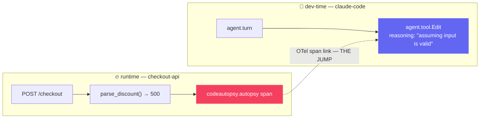

A runtime stack frame gives you `file:line`. `git blame` at the *deployed* commit gives you
the introducing commit. The provenance index maps that `(commit, file, line-range)` to the
AI decision span that wrote it, including the reasoning the agent gave at the time. The
span link is what turns "here's a stack trace" into "here's the ten words of reasoning
that caused it."

**Live:** [landing page](https://aniket-3001.github.io/codeautopsy/) ·
[**try the sandbox demo**](https://aniket-3001.github.io/codeautopsy/demo.html) ·
[sample app](https://codeautopsy-sample-app-182653908302.us-central1.run.app/health) ·
[provenance API](https://codeautopsy-provenance-182653908302.us-central1.run.app/health)

> **Judges — no SigNoz login needed:** the web app shows captured screenshots of the real
> trace + blast-radius dashboard in-app (SigNoz Cloud has no anonymous sharing). Want *live*
> access to the SigNoz workspace? Email
> [aniket22073@iiitd.ac.in](mailto:aniket22073@iiitd.ac.in?subject=CodeAutopsy%20%E2%80%94%20SigNoz%20viewer%20access)
> and I'll add you as a read-only viewer.

## See it in action

<table>
<tr>
<td width="50%" align="center">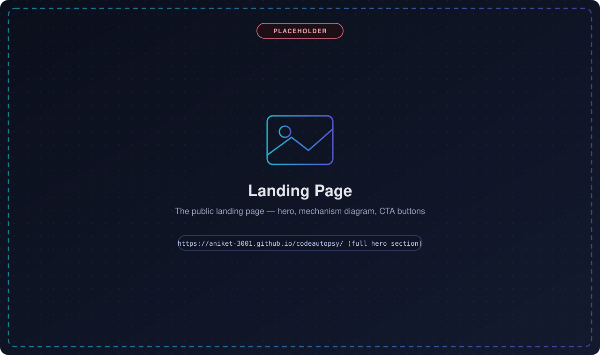<br/><sub><b>Landing page</b> — hero, mechanism diagram, CTAs</sub></td>
<td width="50%" align="center">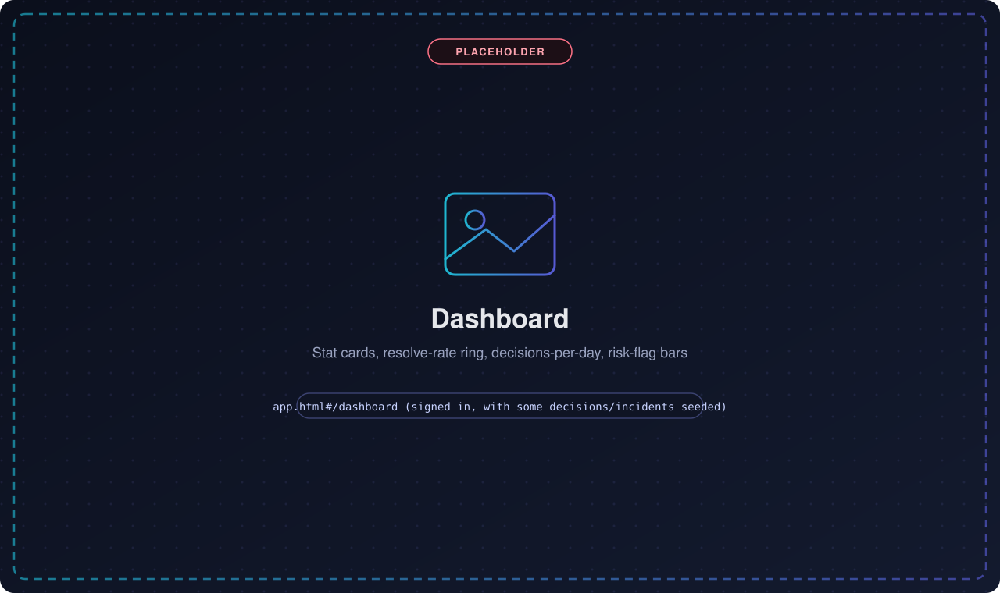<br/><sub><b>Dashboard</b> — stat cards, resolve-rate ring, risk-flag bars</sub></td>
</tr>
<tr>
<td width="50%" align="center">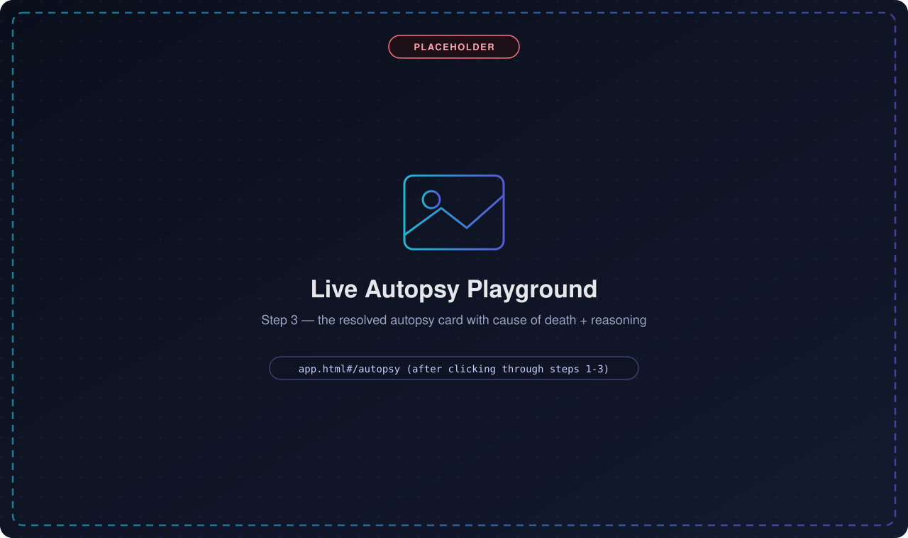<br/><sub><b>Live Autopsy playground</b> — index a decision, simulate a crash, watch it resolve</sub></td>
<td width="50%" align="center">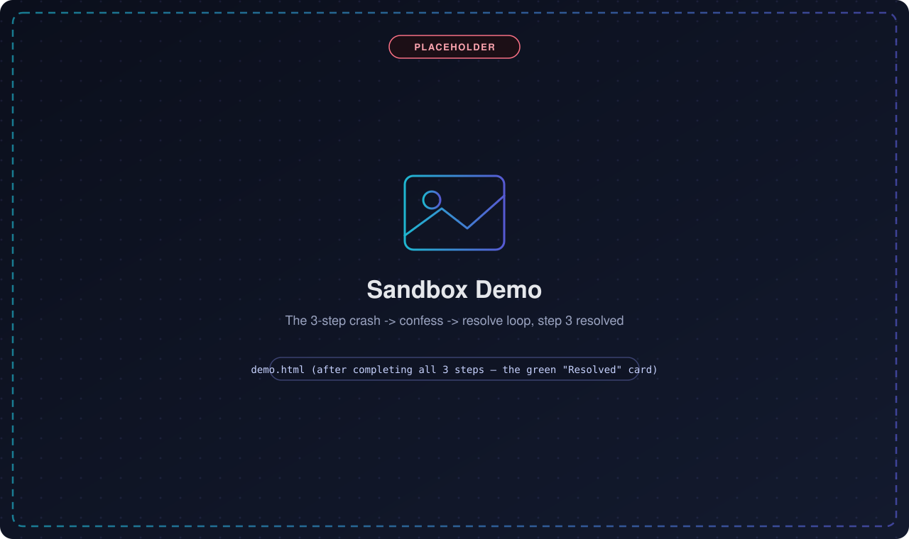<br/><sub><b>Sandbox demo</b> — the 3-step crash → confess → resolve loop, against real infra</sub></td>
</tr>
<tr>
<td width="50%" align="center">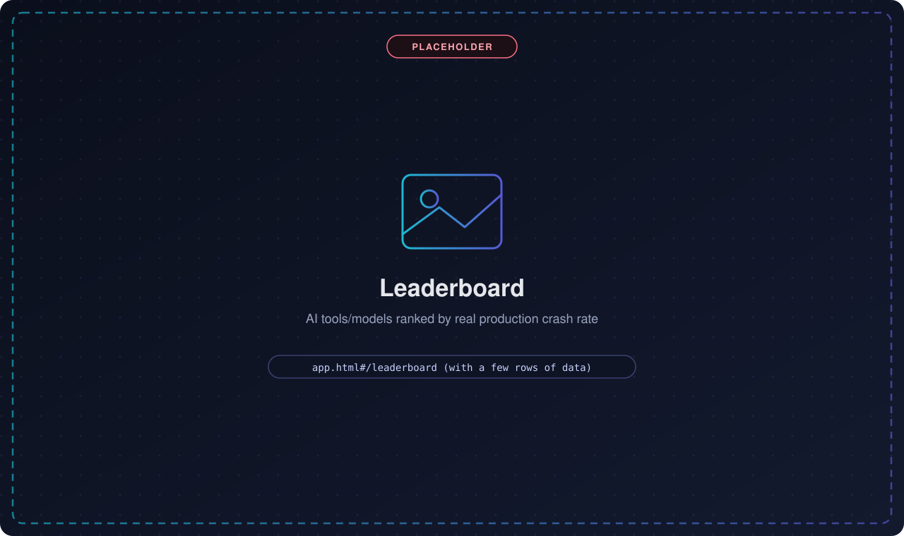<br/><sub><b>Leaderboard</b> — AI tools/models ranked by real crash rate</sub></td>
<td width="50%" align="center">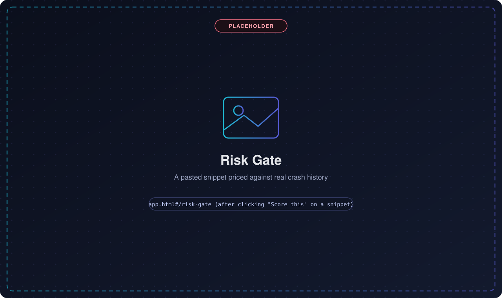<br/><sub><b>Risk Gate</b> — price a pasted snippet against production history</sub></td>
</tr>
<tr>
<td colspan="2" align="center">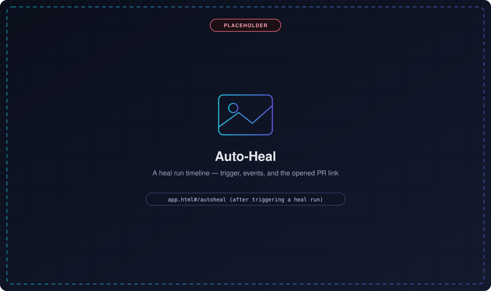<br/><sub><b>Auto-Heal</b> — a SigNoz alert triggers the Fix Bot; watch the run timeline live</sub></td>
</tr>
</table>

## Features

- **Span-link autopsy** — one click in SigNoz jumps from a runtime crash trace to the
  dev-time decision trace that authored the crashing line. Validated on real infra
  (`scripts/day0_smoke.py`).
- **Provenance recorder** — a real Claude Code `PostToolUse` hook captures every AI
  edit as a decision span, with reasoning and heuristic risk flags, agent-agnostic (works
  from any tool via `codeautopsy record`).
- **Coroner CLI** — `codeautopsy autopsy` resolves a crash to its decision; `codeautopsy
  report` renders the *full* chain of custody as a shareable markdown postmortem.
- **Fix Bot** — hands the agent its own genealogy, verifies the patch with a real
  regression test *before* committing anything, opens a PR. The loop stops at the PR — a
  human always merges (see [governance](docs/dev/governance.md)).
- **Auto-Heal (L4)** — a real SigNoz alert on `codeautopsy.crashes` — not a poller —
  fires a webhook that drives the Fix Bot with zero human in the loop, live on the
  dashboard.
- **Prognosis & Risk Gate** — price a snippet's risk *before* merge, against real
  production crash history — same engine as the CI PR-comment bot.
- **Leaderboard** — rank AI tools/models by real, measured crash rate. Not a benchmark
  score — production outcomes.
- **MCP server** — CodeAutopsy *is* an MCP server (`autopsy`/`prognose`/`leaderboard`
  as agent-callable tools), the inverse of most entries in this hackathon, which only
  *consume* SigNoz's MCP server.
- **Multi-tenant SaaS** — org-scoped accounts, API keys, JWT sessions, a full web
  dashboard — not just a CLI demo.

## SigNoz feature coverage

Not just traces. Every service CodeAutopsy runs is instrumented, and each SigNoz signal type
does a distinct, load-bearing job in the product — not a checkbox integration:

| SigNoz capability | Where it's used | Why |
|---|---|---|
| **Traces + span links** | `codeautopsy/enricher/core.py` (`codeautopsy.autopsy` span) | The core thesis: an OTel span link jumps a runtime crash trace to the dev-time decision trace that authored the crashing line. Validated on real SigNoz Cloud infra (`scripts/day0_smoke.py`). Every such span also carries `deployment.ci_run_url` — the GitHub Actions run that built and deployed the crashing revision — extending the chain one hop past the commit: *reasoning → commit → CI run → deployed revision*. |
| **Custom metrics** | `codeautopsy.crashes` (`sample_app/main.py`), `codeautopsy.decisions.indexed` + `codeautopsy.incidents` (`provenance/service.py`) | `codeautopsy.crashes` is what the Auto-Heal alert rule watches. The two provenance-service counters make ingest volume and resolution outcome queryable independent of any single trace. |
| **Logs, trace-correlated** | `enricher/core.py::_emit_autopsy_log` | The AI's own reasoning is emitted as a log record carrying the *same* trace/span id as the autopsy span — so "why did this crash" is filterable as a SigNoz log line, not something you have to open a trace to read, and SigNoz's own trace-to-correlated-logs jump works on it for free. |
| **Alerts → webhook** | Alert rule on `codeautopsy.crashes` → `POST /v1/heal/webhook` (see `docs/dev/operations.md`) | Closes the Auto-Heal loop (L4): a real SigNoz alert — not a poller — is what triggers the Fix Bot with zero human in the loop. |
| **Dashboards** | [`dashboards/codeautopsy-blast-radius.json`](dashboards/codeautopsy-blast-radius.json) — 8 panels across traces, spanning overview stats, time series, a risk-flag leaderboard, and a live unresolved-crash queue | One click from the web app (`Blast Radius in SigNoz 🔍`) into a dashboard built entirely from `codeautopsy.autopsy` span attributes. |
| **MCP — emitting, not just consuming** | `codeautopsy/mcp/server.py` | The inverse of "agent queries SigNoz's MCP server": CodeAutopsy *is* an MCP server, exposing `autopsy`/`prognose`/`leaderboard` as agent-callable tools over the provenance index SigNoz's own MCP server has no way to know about. |
| **Both services traced** | `sample_app/main.py` **and** `provenance/service.py` (`FastAPIInstrumentor`) | The dashboard/API backend isn't a silent, unobserved control plane — it's a first-class instrumented service in the same SigNoz Cloud tenant as the sample app. |
| **Distributed tracing** | `HTTPXClientInstrumentor` (both services) | The enricher's HTTP call from `checkout-api` to `codeautopsy-provenance` propagates W3C `traceparent` context — SigNoz sees one connected distributed trace (`parse_discount` → HTTP call → the provenance service's own `/resolve` span) instead of two unrelated ones, on top of the explicit span *link* the core thesis already relies on. |
| **Service Map / APM** | Free from `FastAPIInstrumentor` on both services | p50/p99 latency, error rate, and request rate per service and per route — no extra code, a byproduct of the tracing above. |
| **Exceptions explorer** | `span.record_exception(exc)` (`sample_app/main.py`) | Every seeded-bug crash is already grouped, deduplicated, and time-bucketed in SigNoz's own exception view. |

Every service exports to a **real, hosted SigNoz Cloud tenant** (`in2` region), not a local
ephemeral container spun up for the demo — the telemetry above is what's actually live in
production right now.

### SigNoz, in-app

SigNoz Cloud doesn't support anonymous sharing. Instead of sending judges to a login wall,
the dashboard shows these two **real, already-captured** screenshots directly in the app:

<table>
<tr>
<td width="50%" align="center">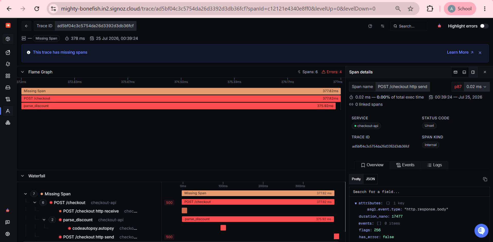<br/><sub>The crash trace — span-linked across the build/run boundary to the decision span</sub></td>
<td width="50%" align="center">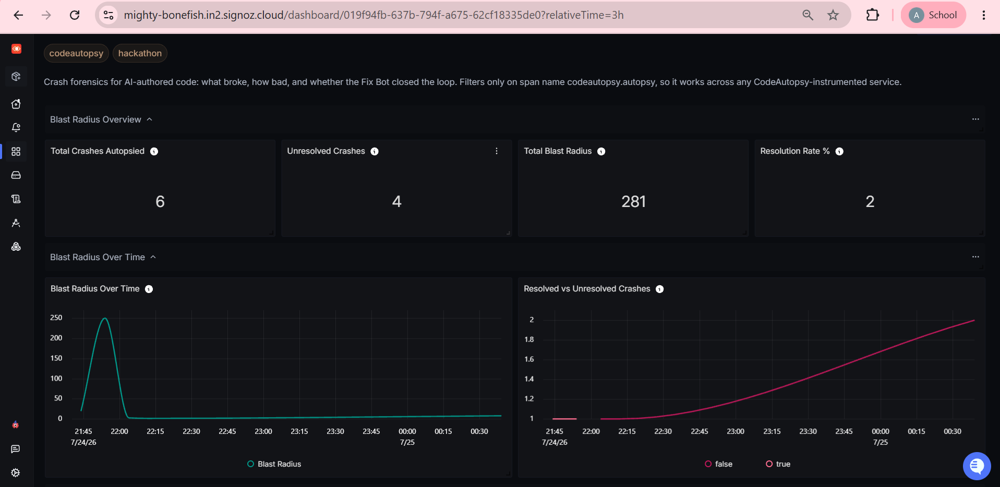<br/><sub>The blast-radius dashboard — every service/span a crash touched</sub></td>
</tr>
</table>

## Architecture

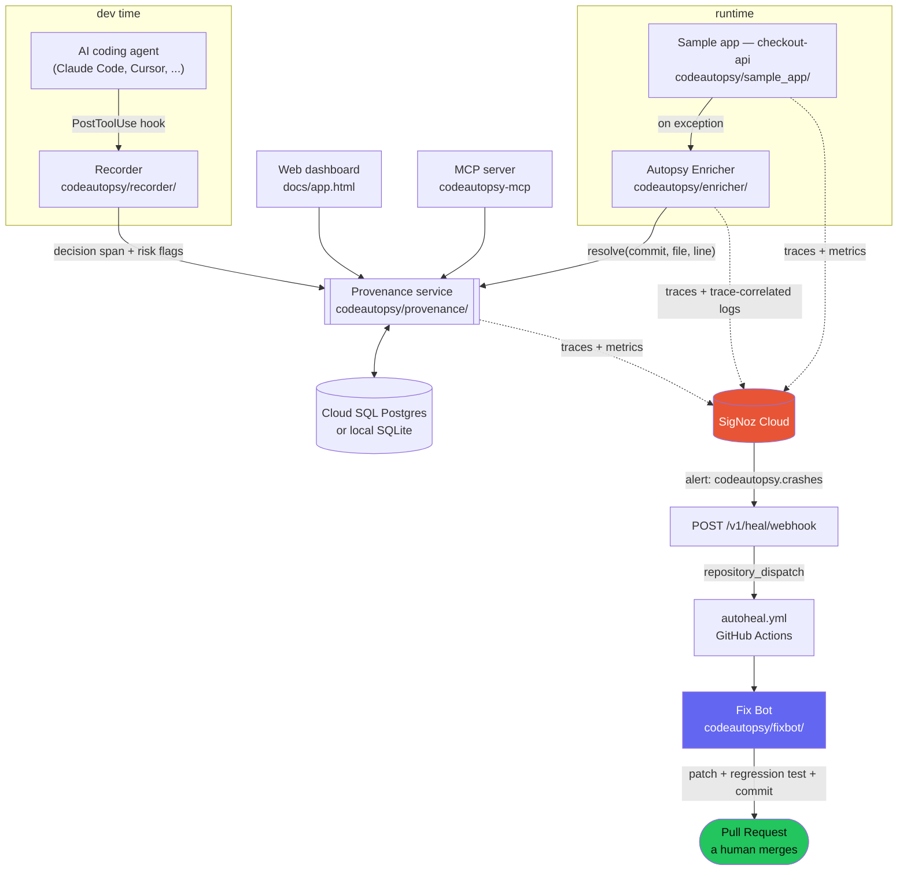

One FastAPI process (`provenance/service.py`) is the multi-tenant SaaS backend: accounts,
API keys, the provenance/incident store, the leaderboard, risk gate, and the Auto-Heal
loop. A second, deliberately-buggy FastAPI process (`sample_app/`) is the "patient" —
crash it, and the whole loop runs for real. The static `docs/` frontend (no build step)
talks to the provenance service directly from the browser.

**Docs:** [semantic conventions](docs/dev/semconv.md) (the `codeautopsy.*` span attributes) ·
[Fix Bot governance](docs/dev/governance.md) (autonomy levels — the loop stops at a PR) ·
[operations](docs/dev/operations.md) · [reproduce locally](docs/dev/reproduce.md) ·
[codebase map](docs/dev/codebase-map.md).

## Components

| Component | Path | Role |
|---|---|---|
| Recorder | `codeautopsy/recorder/` | Claude Code hooks → dev-time decision spans + risk flags |
| Provenance | `codeautopsy/provenance/` | SQLite (default) or Postgres (`DATABASE_URL`) store + git-blame indexer + `resolve` API |
| Sample app | `codeautopsy/sample_app/` | Instrumented FastAPI "patient" with a seeded bug |
| Enricher | `codeautopsy/enricher/` | On exception, mints the linked `codeautopsy.autopsy` span + a trace-correlated reasoning log |
| Coroner CLI | `codeautopsy/cli/` | `codeautopsy autopsy <trace>` — the chain of custody; `report` renders it as a shareable markdown postmortem |
| Postmortem | `codeautopsy/postmortem/` | Pure rendering: crash → cause of death → blame → decision → reasoning → confidence → lesson, as markdown |
| Fix Bot | `codeautopsy/fixbot/` | `codeautopsy fix <trace>` — patch, verify, commit, PR |
| Auto-Heal | `codeautopsy/autoheal/` | SigNoz alert → webhook → Fix Bot, live timeline on the dashboard |
| Reliability | `codeautopsy/reliability/` | Prognosis (risk-gate) + leaderboard scoring, priced against real crash history |
| MCP server | `codeautopsy/mcp/` | `codeautopsy-mcp` — exposes `autopsy`/`prognose`/`leaderboard` as agent-callable tools, each one a span |
| Accounts | `codeautopsy/accounts/` | Org/user signup, JWT sessions, API keys — the multi-tenant SaaS layer |

## MCP server — CodeAutopsy as agent-callable tools

Most Agents-of-SigNoz projects *consume* SigNoz's MCP server so their agent can read telemetry.
CodeAutopsy points the plug the other way: it **is** an MCP server, exposing the one thing only
CodeAutopsy knows — the map from a crashing line back to the AI decision that authored it — so any
MCP client (Cursor, Claude Desktop, an IDE) gets three tools on its menu:

| Tool | Question it answers |
|---|---|
| `autopsy(commit, file, line)` | Which AI coding decision authored this crashing line? |
| `prognose(code)` | What's this snippet's risk, priced against real crash history? |
| `leaderboard()` | Which AI tools/models crash most in production? |

Every call is itself a span (`codeautopsy.mcp.*`) in the same SigNoz pipeline the rest of
the product exports to — dogfooding, not just an integration.

```bash
pip install "codeautopsy[mcp]"    # published on PyPI — https://pypi.org/project/codeautopsy/
# or, from a clone: pip install -e ".[mcp]"
codeautopsy-mcp                   # runs the server over stdio (the transport clients launch)
```

Register it with a client by pointing a stdio server at the `codeautopsy-mcp` command:

```jsonc
// e.g. Claude Desktop / Cursor mcp config
{
  "mcpServers": {
    "codeautopsy": { "command": "codeautopsy-mcp" }
  }
}
```

The server reads the developer's **own** local provenance index (SQLite, or Postgres when
`DATABASE_URL` is set) — no network hop. See `docs/dev/operations.md` for details.

## Tech stack

| Layer | Technology |
|---|---|
| Observability | **OpenTelemetry** (traces, metrics, logs) → **SigNoz Cloud**; span links, distributed tracing (`HTTPXClientInstrumentor`), custom metrics, alerts, dashboards |
| Backend | Python 3.11, FastAPI, pydantic-settings, Typer (CLI), Postgres (`psycopg`) or SQLite |
| Accounts | JWT sessions (`pyjwt`), Argon2 password hashing (`argon2-cffi`), org-scoped API keys |
| Fix Bot | Groq (OpenAI-compatible chat completions, free tier) — patch, verify with a real regression test, commit, PR via `gh` |
| MCP | `mcp` (official Python SDK) — `codeautopsy-mcp` exposes tools over stdio |
| Frontend | Static HTML + vanilla JS, **no build step**, Tailwind CDN — deployed as-is to GitHub Pages |
| Frontend tests | Playwright — drives the real `docs/*.html` files unmodified, `fetch()` mocked |
| Quality | ruff · mypy · pytest (296 tests, ≥95% coverage gate) · GitHub Actions CI |
| Deploy | Docker · Google Cloud Run · Cloud SQL (Postgres) · GHCR · GitHub Pages · Workload Identity Federation (no long-lived keys) |

## Quickstart

```bash
python -m pip install -r requirements-lock.txt   # pinned, reproducible dependency set
python -m pip install --no-deps -e ".[dev]"
pre-commit install             # runs ruff + mypy on every commit (same checks as CI)
cp .env.example .env           # add your SigNoz Cloud endpoint + ingestion key
pytest                         # provenance join engine is fully unit-tested
python scripts/day0_smoke.py   # emit the two linked traces into SigNoz
```

## Configuration

All config comes from environment / `.env` (see `.env.example`). Key vars:

- `OTEL_EXPORTER_OTLP_ENDPOINT` — SigNoz OTLP endpoint (e.g. `https://ingest.in2.signoz.cloud:443`)
- `SIGNOZ_INGESTION_KEY` — SigNoz Cloud ingestion key (git-ignored; never commit)
- `GROQ_API_KEY` — required only for the Fix Bot (`codeautopsy fix`); free key at https://console.groq.com/keys

Full table (every var, including Auto-Heal and CI-run linkage): [operations](docs/dev/operations.md).

## Docker

Run the whole spine (provenance service + instrumented sample app) without a local Python
install:

```bash
docker compose up --build
```

This starts `provenance` (port `8100`) and `sample-app` (port `8000`), sharing a network and a
named volume for `provenance.db`. `sample-app` waits for `provenance`'s healthcheck before
starting. Both containers use an **editable** install (`pip install -e`) so `.git` history ships
inside the image and `git blame`-based resolution behaves identically to a bare-metal checkout —
`sample_app`'s `REPO_ROOT` depends on this. Override `OTEL_EXPORTER_OTLP_ENDPOINT` and
`SIGNOZ_INGESTION_KEY` via a `.env` file to point the containers at SigNoz Cloud.

**Run the whole demo locally, no Cloud, no login wall.** Our hosted demo uses SigNoz Cloud
(no anonymous sharing). To reproduce end-to-end against a **self-hosted SigNoz you control** —
either one command via Foundry ([`casting.yaml`](casting.yaml)) or your own SigNoz + our compose —
see **[docs/dev/reproduce.md](docs/dev/reproduce.md)**.

```bash
curl http://localhost:8000/health                                           # {"status":"ok","commit":"<sha>"}
curl -X POST http://localhost:8000/checkout -d '{"discount_code":"10","subtotal":100}'
```

## Frontend tests

`docs/` is deliberately build-step-free — static HTML with inline vanilla JS, deployed as-is to
GitHub Pages. Test coverage (`e2e/`) uses [Playwright](https://playwright.dev) to drive the real
`docs/app.html`, `docs/demo.html`, and `docs/index.html` files unmodified in a real browser, with
`fetch()` calls to the Cloud Run API intercepted and mocked (`e2e/fixtures.js`) — no live backend
needed. It covers the router's auth-gated redirects, the auth/signup/login/logout flow, dashboard
rendering + filtering + incident modal, the Live Autopsy playground, Risk Gate, Prognosis, the
Leaderboard, Settings/API keys, the Integrate snippets, and the sandbox demo's 3-step crash loop —
plus a regression test that the Auto-Heal poll loop actually stops when you navigate away from
`#/autoheal` (`stopHealPoll()`).

```bash
npm install
npx playwright install --with-deps chromium   # first run only
npm run test:e2e                              # headless
npm run test:e2e:ui                           # interactive UI mode
```

Runs on every push/PR via the `frontend` job in `ci.yml`. Nothing under `e2e/`,
`package.json`, or `playwright.config.js` is published — GitHub Pages only ships `docs/`.

## CI/CD

GitHub Actions (`.github/workflows/`):

- **`ci.yml`** — on every push/PR to `main`: install from `requirements-lock.txt` (pinned,
  reproducible) + editable install, `ruff check`, `mypy`, `pytest` with coverage
  (`fail_under = 95`, see `pyproject.toml`), coverage XML uploaded as an artifact.
  Runs a `postgres:16` service container so `tests/test_provenance_postgres.py` exercises the
  real Postgres backend (skipped locally when `DATABASE_URL` isn't set). A second `frontend` job
  runs the Playwright suite against the real `docs/*.html` files with the backend mocked.
- **`docker-publish.yml`** — on push to `main` (or manual dispatch): builds the image and
  publishes it to GHCR (`ghcr.io/<owner>/<repo>`), tagged by commit SHA and `latest`.
- **`pages.yml`** — on push to `main` touching `docs/`: deploys `docs/index.html` to GitHub
  Pages.
- **`deploy-cloud-run.yml`** — on push to `main` (or manual dispatch): builds the image, pushes
  it to Artifact Registry, and redeploys both Cloud Run services. Authenticates via Workload
  Identity Federation (no long-lived key stored in GitHub). Stamps `CODEAUTOPSY_CI_RUN_URL`
  onto both services from `github.run_id`, closing the chain of custody one hop further.
- **`autoheal.yml`** — triggered by `repository_dispatch` from the deployed provenance
  service's `/v1/heal/webhook` (which itself only fires from a real SigNoz alert on
  `codeautopsy.crashes`). Runs `codeautopsy fix --push --json` — the Fix Bot with zero human
  in the loop — and reports the outcome back to the dashboard's Auto-Heal timeline
  (`scripts/report_heal.py`). This is where the Fix Bot actually executes for a real Auto-Heal
  run; the provenance service only dispatches, it never runs the Fix Bot in-process.
- **`prognosis.yml`** — on every PR to `main`: runs `codeautopsy prognose` against the diff
  and posts the risk-priced findings as a PR comment — the same engine the Risk Gate page
  scores a pasted snippet with, run automatically pre-merge instead of on demand.
- **`publish-pypi.yml`** — on a `v*.*.*` tag (or manual dispatch): builds and publishes to
  PyPI via Trusted Publishing (OIDC — no stored API token). The package is live:
  [`pip install codeautopsy`](https://pypi.org/project/codeautopsy/).

## Deployment

Live on Google Cloud Run, project `codeautopsy-hackathon`, region `us-central1`:

- **Provenance**: https://codeautopsy-provenance-182653908302.us-central1.run.app
  (`min-instances=1` so the `resolve` API stays warm for a demo)
- **Sample app**: https://codeautopsy-sample-app-182653908302.us-central1.run.app
  (points its `CODEAUTOPSY_PROVENANCE_URL` at the provenance service above)

```bash
curl https://codeautopsy-sample-app-182653908302.us-central1.run.app/health
```

**Persistence:** the provenance service is backed by Cloud SQL (Postgres, instance
`codeautopsy-db`), connected via the Cloud SQL Auth Proxy socket (`--add-cloudsql-instances`)
with the DSN injected from Secret Manager (`--set-secrets=DATABASE_URL=...`) — never as a
plaintext env var. Data survives redeploys; verified by submitting a record, forcing a fresh
Cloud Run revision, and confirming it's still there. Local dev and the test suite still default
to the zero-config SQLite store (`ProvenanceStore` in `codeautopsy/provenance/store.py`) unless
`DATABASE_URL` is set.

To reproduce the deploy manually (e.g. onto a different GCP project):

```bash
gcloud auth configure-docker us-central1-docker.pkg.dev
docker build -t us-central1-docker.pkg.dev/<project>/codeautopsy/app:latest .
docker push us-central1-docker.pkg.dev/<project>/codeautopsy/app:latest

gcloud run deploy codeautopsy-provenance --image=us-central1-docker.pkg.dev/<project>/codeautopsy/app:latest \
  --command=codeautopsy-provenance --port=8100 --min-instances=1 --max-instances=1 \
  --set-env-vars="CODEAUTOPSY_PROVENANCE_URL=http://0.0.0.0:8100,CODEAUTOPSY_TARGET_REPO=/app" \
  --allow-unauthenticated

gcloud run deploy codeautopsy-sample-app --image=us-central1-docker.pkg.dev/<project>/codeautopsy/app:latest \
  --command=codeautopsy-sample --port=8000 \
  --set-env-vars="CODEAUTOPSY_PROVENANCE_URL=<provenance-url-from-above>,CODEAUTOPSY_TARGET_REPO=/app,CODEAUTOPSY_RUNTIME_SERVICE=checkout-api" \
  --allow-unauthenticated
```

## Documentation

| Doc | |
|---|---|
| [Developer & agent guide](docs/dev/README.md) | Orientation — what actually exists, how to work on it |
| [Codebase map & invariants](docs/dev/codebase-map.md) | The one join the whole product serves, and what to keep boring |
| [Semantic conventions](docs/dev/semconv.md) | Every `codeautopsy.*` span attribute, the autopsy log, MCP tool spans |
| [Fix Bot governance](docs/dev/governance.md) | Autonomy levels L0–L4 — the loop always stops at a PR |
| [Operations](docs/dev/operations.md) | Every env var, CLI command, HTTP endpoint, deploy workflow |
| [Reproduce locally](docs/dev/reproduce.md) | Run the whole demo against a self-hosted SigNoz you control |
| [Roadmap](docs/dev/roadmap.md) | Competitor-derived feature ideas — what shipped, what was deliberately dropped, and why |
| [Next steps](docs/dev/next-steps.md) | Pending / deferred work, kept current as a pickup point |

## AI assistance disclosure

**This project was built with AI assistance.** Claude (via Claude Code) was used throughout
development — architecture drafting, code generation across the backend and frontend,
documentation, test writing, and iterative debugging, session after session.

The **design decisions were directed by the human author**: the span-link thesis itself,
the git-blame join engine, the Auto-Heal governance model (the loop stops at a PR — no
L5 auto-merge), and the decision to make CodeAutopsy an MCP *server* rather than a
consumer. AI was the pair programmer; the product direction, review, and final judgment
were human. Every claim in this README about what's tested, deployed, or verified live was
checked against the actual running system, not assumed from the code alone.

## License

[MIT](LICENSE)
